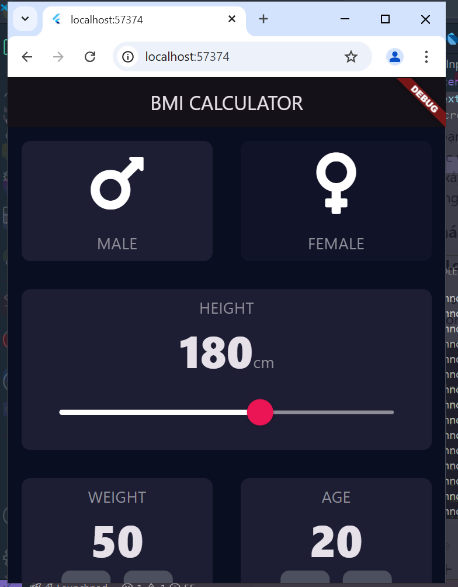
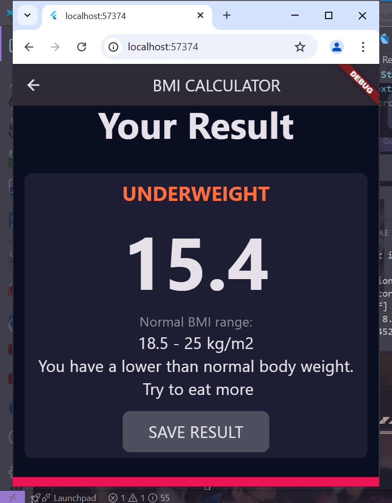

# Dự án BMI Calculator

Dự án "BMI Calculator" là ứng dụng Flutter tính toán chỉ số BMI từ chiều cao và cân nặng của người dùng.

## Nội dung tìm hiểu

Ứng dụng sử dụng:
- **TextField** để nhập liệu.
- **GestureDetector** để xử lý sự kiện.
- **Reusable Card** để tạo giao diện.

## Tài nguyên

- Ảnh demo:
  
    